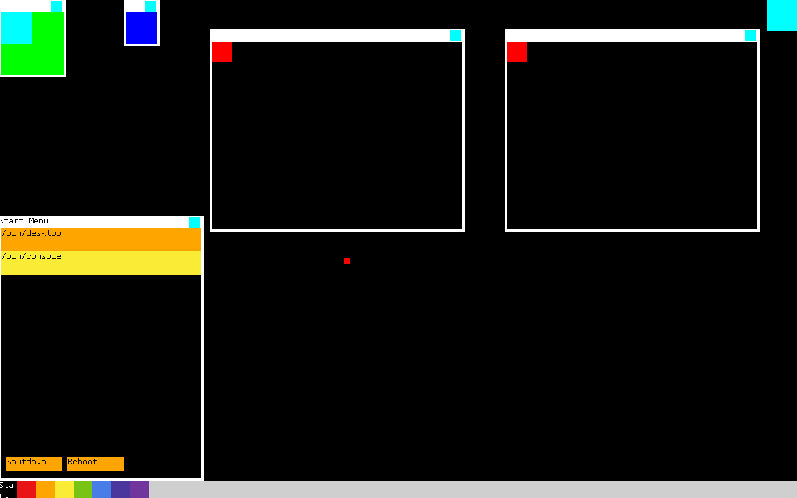

# Crescent
## A custom OS distribution
Crescent is a custom operating system distribution,
that is going to come with its own set of userspace applications
and a desktop environment.

This repository hosts the Crescent kernel and apps.

### Features
- Multithreaded pre-emptive custom kernel
- A set of custom userspace applications including a terminal,
  file manager, desktop environment, browser, media player and some games.
  (**TODO, currently the only userspace application is a very basic desktop environment**)
- Works on real hardware and supports different kinds of devices
- Architectures supported: X86-64, AArch64

### Building the full distribution
Building the whole distribution is best done using [qpkg](https://github.com/Qwinci/qpkg), the required tools for that are:
- Clang >= 19
- [qpkg](https://github.com/Qwinci/qpkg/releases)
- CMake/Meson/Ninja/Make depending on which packages are built
#### Steps
Clone the [crescent bootstrap repository](https://github.com/Qwinci/crescent-bootstrap) using `--single-branch` git option to avoid pulling in binaries from the other branches,
and proceed with the instructions below in that directory.

- Run `make`. This will build the distribution for x86_64,
you can optionally select an architecture with `arch` e.g.
`make ARCH=aarch64`.
- Create an empty image once by running `make create_image`
- Update the image using `make update_image`.
This needs to be done for any changes to the installed packages or the system root to take effect.
- Run the resulting image in qemu using `make run`

Installing other packages is done using `qpkg install <name>`
and running `qpkg sync <name>` to sync the package to the sysroot.
In case you need to rebuild a package you can use `qpkg rebuild <name>`,
it is an alias to `qpkg build install sync --force <name>`.

### Building the plain kernel
It is also possible to build the plain kernel, for that you need the following tools:
- C++ compiler
- CMake
- Ninja (or Make, but the steps below assume Ninja is used)
#### Steps
Note: If you want to cross-compile to a different architecture,
there are some pre-defined cmake toolchain files in `cmake` folder
that you can use by adding `-DCMAKE_TOOLCHAIN_FILE=<path to toolchain file>`
to the cmake command line.
If there isn't an existing toolchain file for the target that you want to build for
then refer to the existing toolchains and CMake documentation on toolchain files
and create a new one.
- `mkdir build`
- `cd build`
- `cmake -G Ninja .. -DBUILD_APPS=OFF`
- `ninja`

Note: `BUILD_APPS` needs to be off when not using a Crescent cross toolchain.

### Todo
- [x] Basic logging
- [x] Memory
    - [x] Page frame allocator
    - [x] Page table manager
    - [x] General purpose memory allocator
- [x] Interrupt handling
    - [x] APIC
    - [x] Exceptions
    - [x] IO-APIC
- [ ] Kernel module loading
- [x] Per-cpu multilevel feedback queue scheduler
- [ ] ACPI
    - [x] FADT
    - [x] MADT
    - [x] MCFG
    - [x] Reboot + shutdown
    - [ ] Power management
    	- [x] Shutdown
    	- [x] Reboot
    	- [ ] Sleep (partially done)
- [ ] Filesystems
    - [x] TAR initramfs
    - [ ] FAT32
    - [ ] Ext4 read
    - [ ] Ext4 write
- [ ] Drivers
    - [x] SMP
    - [ ] AHCI SATA
    - [ ] NVMe
    - [ ] Audio
        - [ ] Intel High Definition Audio (mostly done)
    - [x] PS2
        - [x] Keyboard
        - [x] Mouse
    - [x] Generic PCI device interface
    - [x] Ethernet
        - [x] Realtek RTL8169/RTL8139
    - [ ] Network stack
        - [x] Ethernet
        - [x] ARP
        - [x] IPv4
        - [ ] IPv6
        - [x] UDP v4
        - [ ] UDP v6
        - [ ] TCP v4 (mostly done)
        - [ ] TCP v6
    - [ ] USB
        - [x] Generic HCI interface abstraction
        - [ ] HCI
            - [ ] UHCI
            - [ ] OHCI
            - [ ] EHCI
            - [x] XHCI
        - [x] Keyboard
        - [x] Mouse
        - [ ] Mass storage
        - [x] RNDIS (used eg. for tethering internet from a phone)
- [ ] Apps
  - [ ] Desktop environment (very basic one with almost no functionality is done)
  - [ ] Web browser
  - [ ] Terminal
  - [ ] File manager
  - [ ] Media player
